# Preview

|   |   |   |   |   |   |   |
|---|---|---|---|---|---|---|
| 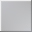 | 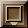 | | 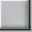 | 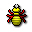 | 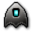 | 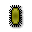 |
| 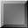 | 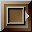 |  | 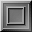 | 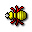 | 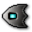 |  |
| 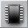 | 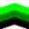 | 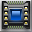 |  | 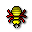 | 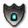 | 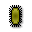 |
| 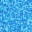 |  |  | 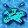 | 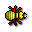 | 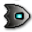 | 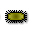 |
| 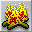 | 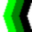 |  | 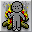 |  | 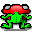 |  |
| | 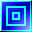 | 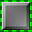 | 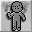 |  | 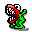 | 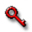 |
| 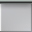 | 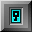 | 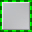 | |  | 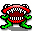 | 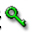 |
| 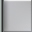 | 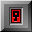 | 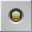 | |  | 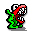 |  |
| 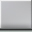 | 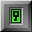 |  | | 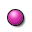 | 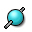 | 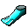 |
| 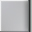 | 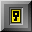 | 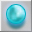 |  |  | 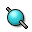 | 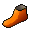 |
|  |  |  |  |  |  |  |
|  |  |  |  |  |  |  |
|  |  | |  |  |  |  |
|  |  |  |  |  |  |  |
|  |  |  |  |  |  |  |
|  |  |  |  |  |  |  |
