# Preview

Some sprites have been optimized by transforming into various orientations at runtime.

|   |   |   |   |   |   |   |
|---|---|---|---|---|---|---|
|  |  |  |  | 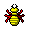 |  |  |
|  |  |  | 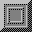 | 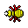 |  |  |
|  |  |  |  | 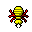 |  |  |
| 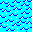 |  |  |  | 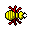 |  |  |
|  |  |  |  | 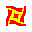 | 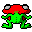 |  |
|  | 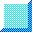 |  |  |  | 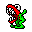 |  |
|  |  |  | |  | 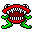 |  |
|  |  |  | |  | 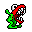 |  |
|  |  |  |  |  | 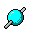 |  |
|  |  |  |  |  | 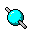 |  |
|  |  | 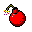 |  |  |  |  |
|  |  | 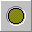 |  |  |  |  |
|  |  |  | 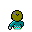 |  |  | 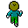 |
|  |  |  |  |  |  | 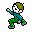 |
|  |  |  |  |  |  | 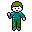 |
|  |  |  | 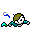 |  |  | 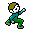 |
