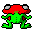
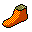

# Preview

|   |   |   |   |   |   |   |
|---|---|---|---|---|---|---|
|  |  |  |  |  |  |  |
|  |  |  |  |  |  |  |
|  |  |  |  |  |  |  |
|  |  |  |  |  |  |  |
|  |  |  |  |  |  |  |
|  | |  |  |  |  |  |
|  |  |  | | |  |  |
|  |  |  | | |  |  |
|  |  |  |  | |  |  |
|  |  |  |  | |  |  |
|  |  |  |  | | |  |
|  |  |  |  | | |  |
|  |  |  |  |  |  |  |
|  |  |  |  |  |  |  |
|  |  |  |  |  |  |  |
|  |  |  |  |  |  |  |
